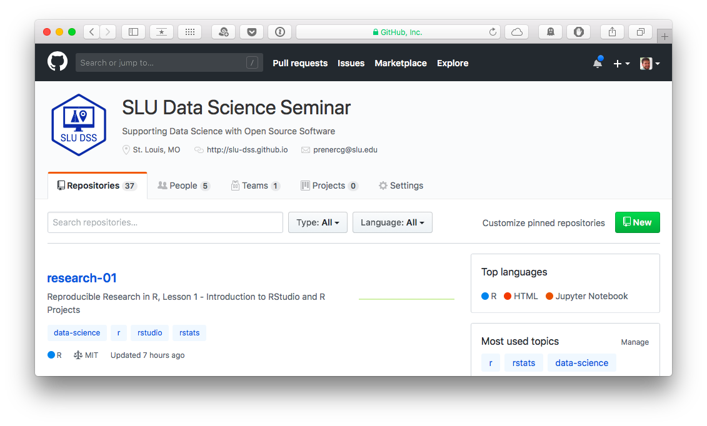

# What We're All About

We're in our **sixth** semester of offering seminars on using `R` for data science. 

We were founded in 2015 by Christy, Chris, and Kelly Lovejoy.

We are a collaborative, interdisciplinary group at Saint Louis University focused on building community around open source software and open science.

---

# What We're All About

We `r emojifont::emoji('heart')` `R`, RStudio, and the `tidyverse`!

--

</br>

Our seminars cover *most* of data science workflow from Wickham and Grollman (2016):

```{r add-workflow-image, echo=FALSE}
knitr::include_graphics("assets/workflow.png")
```

---

# Upcoming Events

### DSS 06: Reproducible Research in `R`

* Session 02 - September 19th
* Session 03 - October 3rd
* Session 04 - October 17th

--

### Other DSS Events

* Open Science Meetup - October 5th
* Brownbag, Power Analyses in `R` (South Campus) - October 31st
* Brownbag, Using Python for Automating Routine Tasks - November 28th

--

### RLadies

* Reproducible Research in `R` - October 3rd
* Plotting something great: Making graphs in `R` - November 14th

---

# GitHub

We host all of our materials on GitHub. If you want to get back to the lesson materials later, head to [https://github.com/slu-dss](https://github.com/slu-dss) and look for the `reserch-01` repository (a special type of folder).

```{r add-github-image, echo=FALSE}

```

---

# Getting Started

You need to have `R` installed and **RStudio** open.

You also need to have executed the following two functions in the console:

```r
install.packages("usethis")

usethis::use_course("https://bit.ly/2wISdxO")
```

RStudio should open a new window that says `research-01` in the upper right hand corner.
