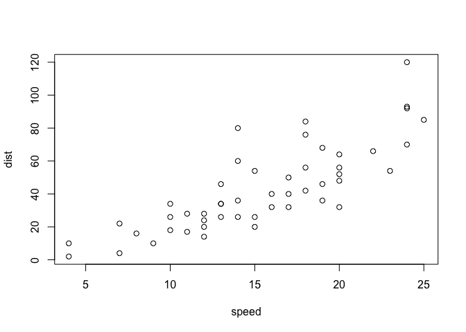

Reproducible Research in R, Lesson 1
================
Christy Garcia, Ph.D. and Christopher Prener, Ph.D.
(September 04, 2018)

## R and RStudio Basics

R is a programming language that is highly extensible and flexible - it
can be adapted to work with everything from textual data to statistical
and spatial data. [RStudio](http://rstudio.com) is a user interface for
R that makes working with the language *much* easier. The first three
features below that we’ll discuss briefly are all aspects of RStudio -
they are not part of the basic R releases.

### R Notebooks

This is an [R Markdown](http://rmarkdown.rstudio.com) Notebook. When you
execute code within the notebook, the results appear beneath the code.
We’ll use notebooks throughout the seminar series. Before each session,
we’ll post a notebook on Github with certain code missing so that you
can follow along and practice writing code. After each session, we’ll
post a complete notebook with the “answers” so that you can go over it
after the session or get caught up if you missing a session.

Try executing this chunk by clicking the *Run* button within the chunk
or by placing your cursor inside it and pressing *Cmd+Shift+Enter*.

``` r
plot(cars)
```

<!-- -->

Add a new chunk by clicking the *Insert* button on the toolbar and
choosing `R`.

When you save the notebook, an `html` file containing the code and
output will be saved alongside it (click the *Preview* button or press
*Cmd+Shift+K* to preview the `html` file). The `html` file will always
be saved in the directory that your R Markdown file is saved in.

If you want to create a new R Notebook, you can do so by going to `File
> New File > R Notebook`. We’ll talk more about notebooks and markdown
in the third sessions this semester.

## Packages

Packages are the way that we can extend the base R software. They are
typically written by R users and made available for free via a series of
servers called CRAN. (We will eventually write our own package this
semester\!)

To install new packages, we use the `install.packages()` function where
the package name is written inside the parentheses in double quotes -
“package name”. This notebook requires a number of pre-installed
packages, including `base`, `datasets`, and `utils`. These packages are
already installed and loaded each time you open `R`. There is one
additional package that we’ll need to install and load. We’ll use
`install.packages()` to install CRAN packages:

``` r
install.packages("cowsay")
```

We almost always install packages from the Console instead of in our
notebooks so that we don’t unintentionally replace or break a key
package in the middle of an analysis.

You should occasionally update packages when you are not in the middle
of an important project using:

``` r
update.packages()
```

You will have to type `y` or `Y` or `Yes` at each prompt.

With those packages installed, we’ll start by loading our one package.
Using new packages is a two-step process: first, you install the
package, and then you load it using the `library()` function:

``` r
library(cowsay)
```

You only need to install `R` packages once using `install.packages()`.
At the beginning of each session / notebook, however, you will have to
load them using the `library()` function. If you get the following error
message, it means you need to use the `library()` function to load the
package that your function is included in:

``` r
mutate()
```

So, in this case, we would need to load the package that the `mutate()`
function is housed in.

## Load Data

After we load any packages we might need, our next task is going to be
to load the data that we need. For now, this will mean loading data from
a package, but in the next session we will look at importing data from
several different sources (Excel, SPSS, etc.).

Data will be imported into an “object” - a name in your “environment”
(essentially, in `R`’s memory) where it is held so that it can be
referenced later. For example, we could make an object named “prof” and
assign my name to it:

``` r
prof <- "Christy"
```

You should now see the `prof` object in the `Enviornment` tab in
RStudio\! We can enter an object name by itself in the console to print
its contents:

``` r
prof
```

    ## [1] "Christy"

Now you try - create an object named `student` and assign your name to
it. After you create the object, print it:

``` r
student <- "Jane"
```

We’ll do the same thing this time, except we’ll load some data from the
`datasets` package. The `datasets` package comes pre-installed with `R`
and contains a variety of fun and/or useful data sets. We’ll load some
data describing eruption intervals from the [Old Faithful
geyser](https://en.wikipedia.org/wiki/Old_Faithful):

``` r
geyser <- faithful
```

To explore the geyser data, we can use two functions. The first, `str()`
or “structure”, gives us a summary of its contents:

``` r
str(geyser)
```

    ## 'data.frame':    272 obs. of  2 variables:
    ##  $ eruptions: num  3.6 1.8 3.33 2.28 4.53 ...
    ##  $ waiting  : num  79 54 74 62 85 55 88 85 51 85 ...

We’ve got two variables - one named `eruptions` and one named `waiting`.

Next, we can use `View()` to open a spreadsheet like view of the data.
Type this down in your console - it is a function that really doesn’t
belong in notebooks.

``` r
View(geyser)
```

You can also click on the geyser object in the `Enviornment` tab to open
up the same spreadsheet view of the data.

Now, you try. There is also a data set called `beaver1` in the
`datasets` package. Assign it to a new object called `beaverData` and
use the `str()` function to explore its contents:

``` r
beaverData <- beaver1

str(beaverData)
```

    ## 'data.frame':    114 obs. of  4 variables:
    ##  $ day  : num  346 346 346 346 346 346 346 346 346 346 ...
    ##  $ time : num  840 850 900 910 920 930 940 950 1000 1010 ...
    ##  $ temp : num  36.3 36.3 36.4 36.4 36.5 ...
    ##  $ activ: num  0 0 0 0 0 0 0 0 0 0 ...

## Working with Functions

So far, all of the functions that we have used have taken a single
argument in the parentheses:

``` r
install.packages("cowsay")
str(geyser)
View(geyser)
```

Function calls can be made more complex in two ways. First, functions
can be *nested* within each other. For instance, if we want to generate
a list of the animals included in `cowsay`, we could try to print the
`animals` object. It is quite messy, so we won’t do it in the notebook,
but you can try in the console if you’d like:

``` r
animals
```

To extract just the names, we can use the `names()` function:

``` r
names(animals)
```

    ##  [1] "cow"          "chicken"      "clippy"       "poop"        
    ##  [5] "bigcat"       "ant"          "pumpkin"      "ghost"       
    ##  [9] "spider"       "rabbit"       "pig"          "snowman"     
    ## [13] "frog"         "hypnotoad"    "shortcat"     "longcat"     
    ## [17] "fish"         "signbunny"    "facecat"      "behindcat"   
    ## [21] "stretchycat"  "anxiouscat"   "longtailcat"  "cat"         
    ## [25] "trilobite"    "shark"        "buffalo"      "grumpycat"   
    ## [29] "smallcat"     "yoda"         "mushroom"     "endlesshorse"
    ## [33] "bat"          "bat2"         "turkey"       "monkey"      
    ## [37] "daemon"       "egret"        "duckling"     "duck"        
    ## [41] "owl"

This is great, but it would be better if it were presented in
alphabetical order, so we’ll *wrap* the `names(animals)` function call
in the `sort()` function:

``` r
sort(names(animals))
```

    ##  [1] "ant"          "anxiouscat"   "bat"          "bat2"        
    ##  [5] "behindcat"    "bigcat"       "buffalo"      "cat"         
    ##  [9] "chicken"      "clippy"       "cow"          "daemon"      
    ## [13] "duck"         "duckling"     "egret"        "endlesshorse"
    ## [17] "facecat"      "fish"         "frog"         "ghost"       
    ## [21] "grumpycat"    "hypnotoad"    "longcat"      "longtailcat" 
    ## [25] "monkey"       "mushroom"     "owl"          "pig"         
    ## [29] "poop"         "pumpkin"      "rabbit"       "shark"       
    ## [33] "shortcat"     "signbunny"    "smallcat"     "snowman"     
    ## [37] "spider"       "stretchycat"  "trilobite"    "turkey"      
    ## [41] "yoda"

`R` functions are endlessly nestable, but you should do this with
caution - the more times you nest within a function, the harder it
becomes to read and de-bug\!

The second way we can extend functions is by specifying multiple
arguments:

``` r
say(what = "gobble gobble", by = "turkey")
```

    ## 
    ## 
    ##  ------------- 
    ## gobble gobble 
    ##  -------------- 
    ##               \   
    ##                \  
    ##                 \
    ##                .--.
    ##               /} p \             /}
    ##              `~)-) /           /` }
    ##               ( / /          /`}.' }
    ##                / / .-'""-.  / ' }-'}
    ##               / (.'       \/ '.'}_.}
    ##              |            `}   .}._}
    ##              |     .-=-';   } ' }_.}
    ##              \    `.-=-;'  } '.}.-}
    ##               '.   -=-'    ;,}._.}
    ##                 `-,_  __.'` '-._}
    ##               jgs   `|||
    ##                    .=='=,

Parameters like `what` and `by` give a function specific pieces of
information. Always name the parameters - it makes your function easier
to debug and more explicit\!

Now, your turn. Pick a new animal and give it its own message:

``` r
say(what = "hoooo... hoooo", by = "owl")
```

    ## 
    ##  ----- 
    ## hoooo... hoooo 
    ##  ------ 
    ##     \   
    ##      \  
    ##       \
    ##        /\___/\
    ##        {o}{o}|
    ##        \ v  /|
    ##        |    \ \
    ##         \___/_/       [ab] 
    ##           | |

## Getting Help

If you want to get help from within `R`, there are two easy way to bring
up documentation files in the `Help` tab in the lower right-hand corner.
The first is the single question mark, which can be used with a package
name:

``` r
?base
```

The single question mark can also be used with a function name:

``` r
?install.packages
```

If you don’t find what you need, or a package/function does not have
help files created for you, you can use the double question mark
operator to search for additional resources:

``` r
??cowsay
```

Now, you try getting help for the `datasets` package:

``` r
?datasets
```

## R Projects and Working Directories

R Projects are a special type of file associated with RStudio. They
create self-contained directories and environments that increase the
reproducibility of your work. They also take care of managing the
working directory for you. The working directory is an often difficult
to grasp concept at first. Think of it as a postal address - this is
where `R` will expect all information to come from and go to about a
project. You can view the current working directory with `getwd()`:

``` r
getwd()
```

    ## [1] "/Users/chris/GitHub/DSS/research-01/notebook"

R projects create a home for your analyses. When you set a R project up,
it will change the **working directory** to the project’s directory.
This means that all of the data you save from RStudio will be saved
there by default. It also means that you can open files saved in that
directory without needing to worry about file paths.

We’ll give you an R project directory to download for each seminar
session. However, if you want to create a new project for your own work,
go to `File > New Project...` and follow the prompts. You can create a
new project directory, associate a project with an existing directory,
and even add `git` version control if you know how to use it\!
